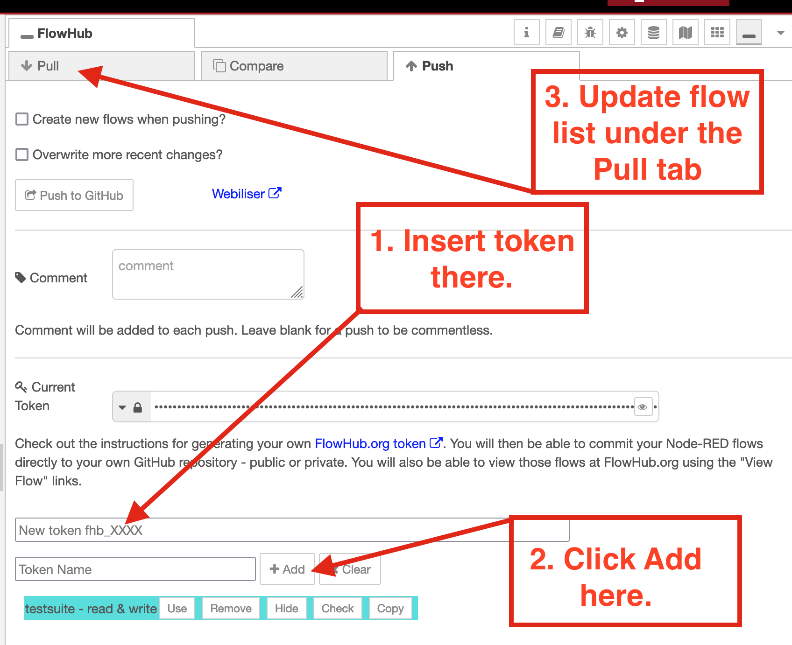
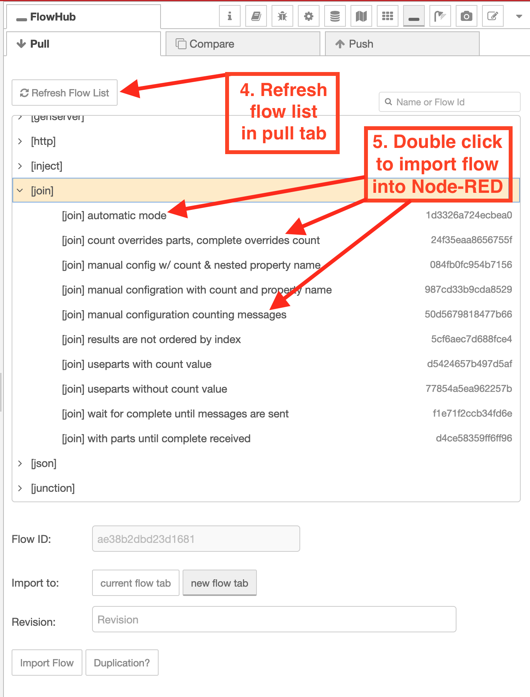
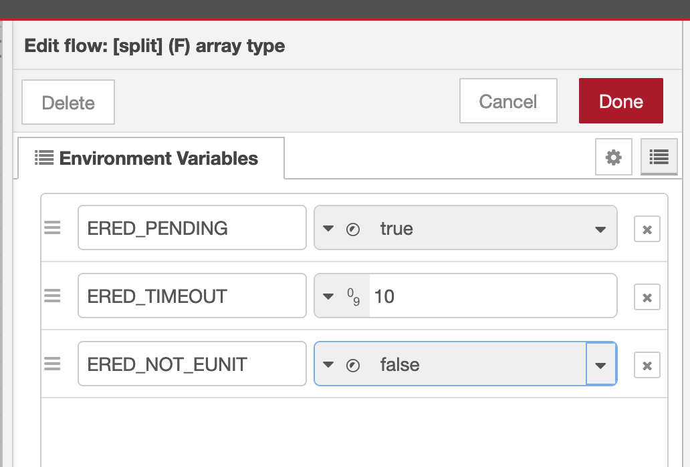

# Erlang-Red Flow Testsuite

A collection of test flows to ensure node compatibility with original Node-RED nodes.

These flows are designed to be executed using the orignal [Node-RED](https://nodered.org) and the Erlang version - [Erlang-Red](https://github.com/gorenje/erlang-red).

They provide a definition of what functionality is expected from the existing core nodes of Node-RED.

These flows utilise the [erlang-red-unittest](https://github.com/gorenje/erlang-red-unittesting-nodes) nodes to ensure conformance.

## work in progress for a proof of concept

The flows are hardwired into the [Erlang-Red project](https://github.com/gorenje/erlang-red/tree/main/priv/testflows) but will be kept in sync with their copies here.

## FlowHub

Direct access to this repository is possible:

- from within Node-RED or Erlang-Red via the [FlowHub](https://flows.nodered.org/node/@gregoriusrippenstein/node-red-contrib-flowhub) nodes
- [Erlang-Red online instance](https://ered.fly.dev/erlang-red)
- [Browser-Red serverless Node-RED instance](https://deadred.openmindmap.org)

Using the following read-only token:

```
fhb_WyIreTFVdjA5aG96bW9lVW1aeG41SE1RPT0iLCI4WTM3ODR1dzhRVWpRanBNU0lQVEM2OG5PRVZwRFZpQm84M0dTT3VRTVdEcmh6N0VyUTk2a1JXVUZpdWZkUnZLS0pTb0NBWmRnT25oa3g3VHlRcUd3ZUM2SmU0RTNZOUJwbjN2alRqc2dMNi9tekswUkRPYzlaNjBEZ0RoUzBtbnZMeFFUSWZIV3oxczZMYTRYTXA4UVFldmsxM0hGWlcwS2RrVEEzaVB4ZjBSTW4xdTF0UXZjYjIyRDI2ZEpTQUI0Q3dDdzd1NXdzZlB3dWd0N1VKT3RmUGkzakNDRzcwaVd6dzdFdkZrNGlyTFl2S2Z6cThMIl0
```

How to add the token to the FlowHub nodes:




Then open the pull tab to refresh the test suite list:



Double clicking on any test flow will import that flow.

This token also works in the [browser-only serverless](https://deadred.flowhub.org) version of Node-RED, for those who do not wish to install Node-RED.

## Git Clone

Adding test cases can be done by either creating a pull request here or via the FlowHub nodes. For that, a fork of this repository will be necessary. Commit to the fork via the FlowHub nodes and then create a pull request.

Structure of the repository is that the flow id is the directory name and in the directory is the flows.json file containing the flow, nodedetails.json which is a list of dependencies of the flow and an SVG image of the flow. These artifacts are all generated by FlowHub when updating a repository with a flow. Don't create them by hand!

## How do these flows work?

At the moment, the flows are only used in ErlangRED so I can only talk of how they are used there.

Each flow has one or more active inject node. At the beginning of a test, all active inject nodes are triggered by the [unit test engine](https://github.com/gorenje/erlang-red/blob/c0cdebe6e0af83747fe406771bd50cf6ad59a528/src/servers/ered_unittest_engine.erl#L193-L200) - that starts a flow running.

The [assert nodes](https://flows.nodered.org/node/@gregoriusrippenstein/erlang-red-unittest) can be used to ensure specific parts of the flow are reached or not reached and that specific values are set on the message object at specific points of the flow. These nodes then provide the answer to the question: did the flow succeed or not? Was the tested functionality correct?

These tests are also triggered when eunit is called by rebar. Each flow becomes a [single test case](https://github.com/gorenje/erlang-red/blob/c0cdebe6e0af83747fe406771bd50cf6ad59a528/test/flow_file_test.erl#L199-L217) and are executed in parallel. The test case has a timeout of three seconds and if a flow isn't completed in those three seconds, it is marked as having failed.

This timeout can be extended by setting the `ERED_TIMEOUT` value in the environement tab of the flow test:



If a test is failing because the corresponding functionality does not exist, then the `ERED_PENDING` flag should be set to true. This makes a test todo - something needs to be implemented to make the test work. This should not be used to ignore incorrect behaviour or bugs. For that use the flag `ERED_THIS_IS_BUGGY_BS`.

It also possible to exclude test flows from being executed by eunit by setting the `ERED_NOT_EUNIT` flag to **true** (I am not undefinitely a fan of double negations). Why a flow test should not be run by eunit is related to the fact that Cowboy isn't started when doing eunit testing, so the http nodes, for example, don't work.

## Guarantees of correctness?

None.

I definitely make [an effort](https://discourse.nodered.org/t/switch-node-check-all-mode-and-otherwise-why-does-otherwise-not-match/96794) to get things right, but I also make mistakes.

## Can I add/correct a test case for a node?

Yes please!

See above for how, ideally via FlowHub because of the artifacts but I can also do that - so you can even just [mail](mailto:testflows@spread-the.love) me the test flow :)

## License

Oh, yes nearly forgot the most importart part: there is no license because I forgot to add one. Just don't do anything evil with this stuff. Or drop me a line and I'll [exclude you](https://opensource.stackexchange.com/questions/2468/is-there-a-license-which-prevents-misuse-of-the-source-code/2471#2471) from that sentiment.
